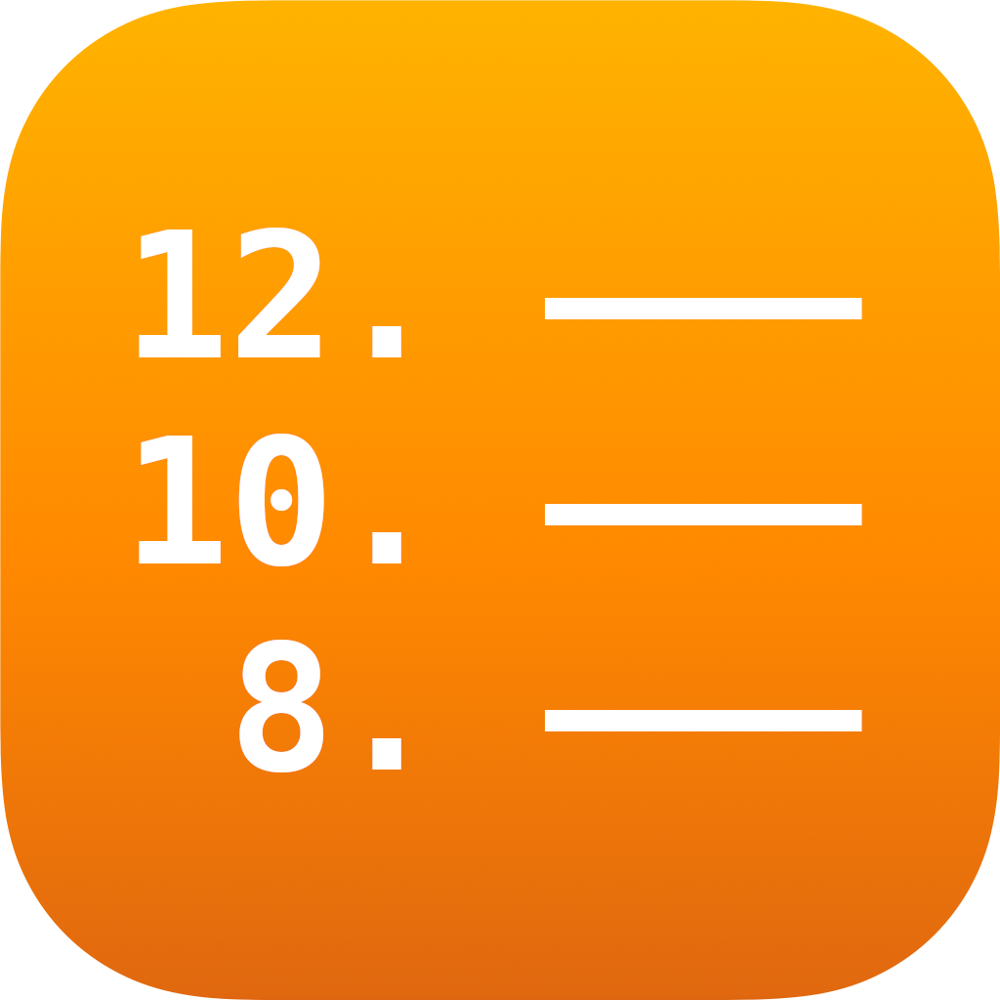
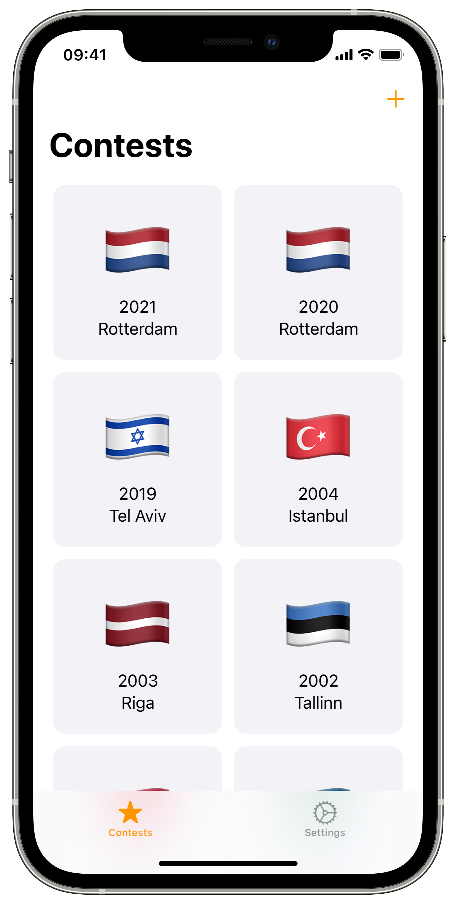
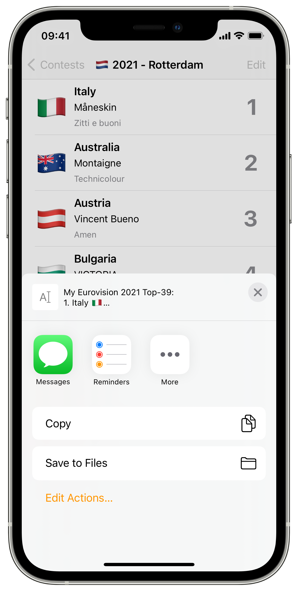
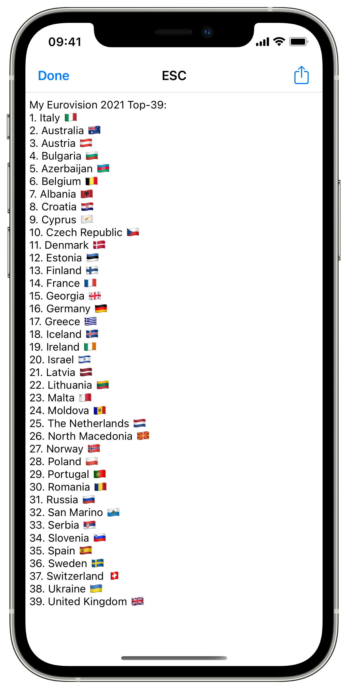
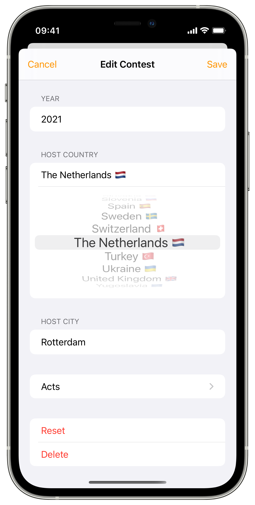
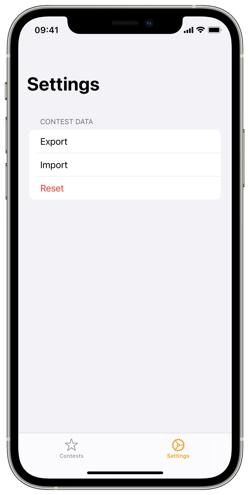
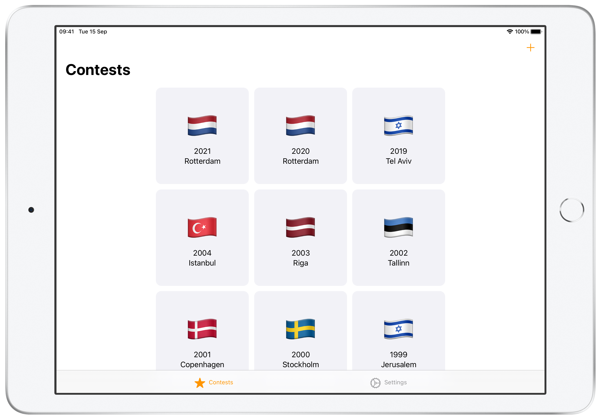

 
  
  
  
  <h1 align="center">ESCoreboard</h1>  
  

    ESCoreboard is an app that allows you to create scoreboards for Eurovision Song Contest and share them with your friends.
  

## Features
- Create scoreboards for Eurovision Song Contest

 

- Share them with your friends

 

- Add news contests or edit existing ones

- Export and import scoreboards

- Create scoreboards on iPadOS or Macs with Apple Silicon

## Requirements
- iOS 14.5+
- iPadOS 14.5+

## License

Distributed under the GPLv3 license. See `LICENSE.md` for more information.
